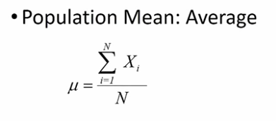
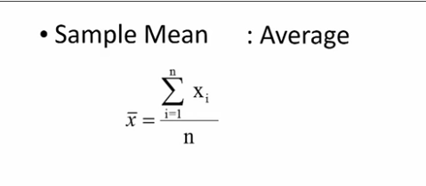
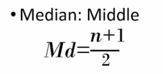

# Central Tendency

## Mean

- Summing over the total number of values and dividing by the number of values

## Median

- Middle most value
- (total values + 1) / 2 = Position of the median value
- If it's in the middle of 2 values, use the average of the two values

## Mode

- Most frequent value
- Easily seen in histogram
