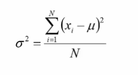
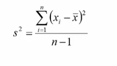

# Variance

- How spread apart are the data values

## Range

- Max value - Min Value
- Tells how disperse the data is

## Variance

- Each individual value subtracted from the mean divided by the total number of observations (-1 for a sample)

## Standard Deviation

- Square root of the variance

## Standard Error

